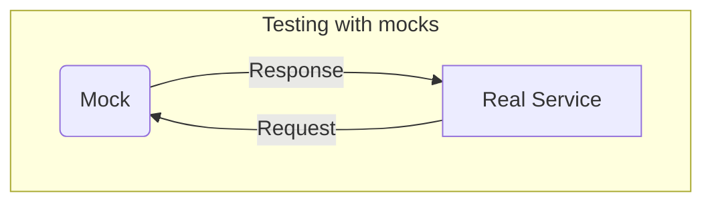
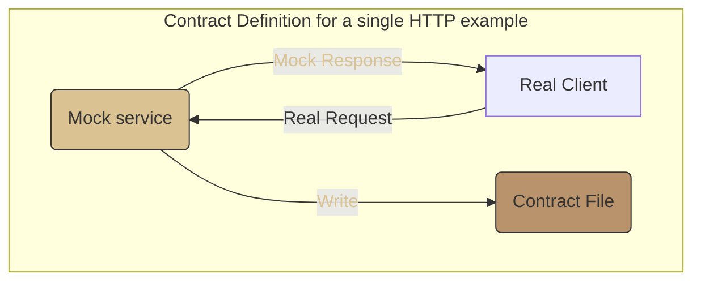
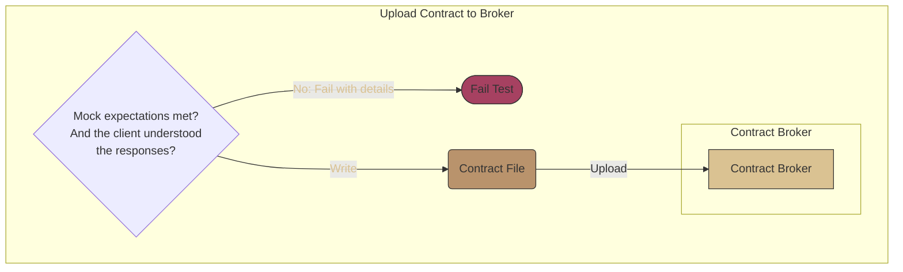
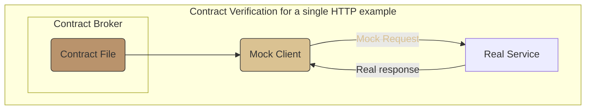

# Introduction to contract testing

Contract testing is a simple, effective and automated way to build confidence
that your software deployments don't contain or rely on breaking API changes. If
you've ever experienced downtime because of an accidental breaking API change,
then contract testing is for you.

Contract testing builds deployment confidence by testing whether two services (eg an http client and an http server) are able to
communicate with each other. You can think of it as a unit test, where the
"unit" is allowed to cross a communication boundary. Or, you can think of it as asynchronous integration tests.

> If you have not previously been exposed to contract testing, you have probably
> used one of the three main alternatives - end-to-end tests, schema tests, and
> mocking. You can read more details about how contract testing improves over these approaches in [alternatives to contract testing](/docs/users/background/alternatives.md).

## What is contract testing

> In this documentation, `service` is used to describe any communicating client, server, message producer or consumer.

Contract testing was originally [defined by Martin
Fowler](https://martinfowler.com/bliki/ContractTest.html) is like mocking your
services dependencies, but the behaviour of the mock is later compared against
the real dependency. For example, here's a diagram of how a single test for an HTTP
request/response pair works using only mocks:

In a contract test, you then write down the mock's expectations in a contract file ([contract definition](/docs/users/basic-use/defining-contracts.md)), and later replay it again against the real server ([contract verification](/docs/users/basic-use/verifying-contracts.md)).

For example, in an HTTP contract test, first the mock is configured with an
expected request and response pair. Then, if the real request matched the
expectations, the contract file is written.

Contract definition is where you write one or more expectations for the mock. In `Case`, these expectations are called Examples.

- Each example is independent

Then, if the mock has received all the expected requests, and your tests to ensure
the responses can be understood also pass, then the contract file will be
written.

This contract file can then be uploaded to a broker, so that it can be
downloaded by other dependencies that need it. The broker is a key part of the value of contract testing - it might notify the
relevant service CI pipelines that there is a new contract, and it can also remember verification results. You can read more about brokers in [configuring a broker](/docs/users/basic-use/brokers.md).

The next step is to run one or more contract file(s) against the real service
real service. This confirms that the expectation of the client(s) are met by the real service.

Next, read about [defining a contract in Case](/docs//users//basic-use/defining-contracts.md).

<!--- cspell:dictionaries !html --->
