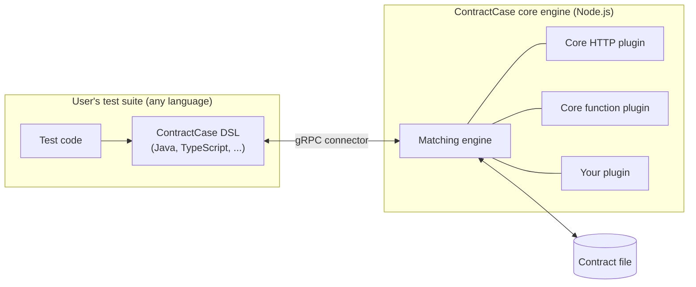

# Extending ContractCase with plugins

ContractCase is plugin-first: every interaction type and matcher that ships
with ContractCase is implemented using the same plugin API that is available to
users. Anything the core interactions or matchers can do, your plugin can do too.

This section describes how to write, load and distribute your own plugins. 
Using this section, you should be able to 
implement a plugin without any additional knowledge of the ContractCase internals.

:::tip note

If you're planning a plugin, we'd love to hear about it - please say hello by
opening [an issue](https://github.com/case-contract-testing/contract-case/issues/new).
This is doubly useful while the plugin framework is in beta, as we can let you
know about any upcoming changes that might affect you.

If your extension is likely to be of general use, consider making a pull
request to add it to the core plugins instead.

:::

## What can a plugin do?

A plugin can extend ContractCase with:

- **New matcher types**: A matcher is a node in the tree that describe the expected data
  in an interaction (for example, "any integer", or "an array of at least two
  user objects"). You might add a matcher for a data format that ContractCase doesn't
  understand yet - say, matching the timestamp portion of a [ULID](https://github.com/ulid/spec). Or, you might
  add a convenience matcher that combines two or more other matchers.
- **New mock types**: A mock is the executable part of an interaction. This is what
  pretends to be the other side of the communication during a test (for
  example, a mock HTTP server). You might add a mock type for a new transport -
  say, gRPC or a message queue.
- **DSL declarations**: descriptions of the user-facing classes and functions
  for your matchers and mocks, so that they can be generated in each language
  that ContractCase supports.

## How plugins fit into the architecture

Because the core of ContractCase is Javascript, plugins are always JavaScript (or Typescript, complied to JS). 
A plugin runs inside the ContractCase core engine - _no matter which language the user's test suite is
written in_. A Java test suite talks to the core engine over a gRPC connector,
and the core engine loads your plugin locally:

This architecture ensures that we have:

1. **Consistent behaviour across languages.** The contract should mean the same
   thing during definition and during verification - even
   when the two sides are written in different languages. If matchers and interaction mocks were
   reimplemented per-language, behaviour differences could creep in.
2. **Available everywhere.** Because the behaviour lives in one
   place, adding a new language to ContractCase doesn't require porting every
   plugin. A plugin author writes the behaviour once, and (with a
   [DSL declaration](./dsl-generation)) the user-facing classes can be
   generated for each language.

This has two trade-offs - 

1. User-facing DSL classes for your plugin do need to exist in each language. We've provided a DSL generator to make this easy. If you haven't published a DSL in a user's language, they can generate it from your plugin definition. 
   See [Declaring your DSL](./dsl-generation) for how this works.
2. Plugins must be written in Javascript. This is a limitation of the design choice. Long term, we might add the ability to call out to other languages as part of the plugin framework. Please raise an issue if you'd like to discuss this.

## What's in this section

1. [The anatomy of a plugin](./writing-a-plugin) - the plugin object, how it's
   structured, and the naming rules you'll need to follow
2. [Writing matchers](./writing-matchers) - adding new matcher types
3. [Writing mock types](./writing-mocks) - adding new interaction types
4. [Declaring your DSL](./dsl-generation) - describing your user-facing
   classes so they can be generated in each supported language
5. [Loading and distributing plugins](./loading-plugins) - how users load your
   plugin, and what to know before publishing it

You may also want the description of the
[contract file format](./contract-format) - useful background,
since your matchers and mock descriptors are written into the contract file.

## Stability

ContractCase is in beta, see the [versioning policy](../package-versioning). Breaking
changes to the plugin API will always be listed in the [@contract-case/case-plugin-base Changelog](https://github.com/case-contract-testing/contract-case/blob/main/packages/case-plugin-base/CHANGELOG.md)

