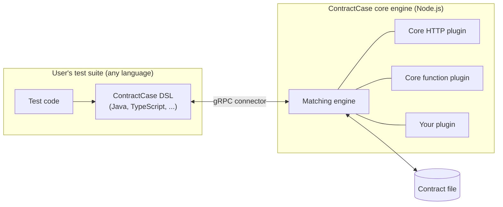

# Extending ContractCase with plugins

ContractCase is plugin-first: every interaction type and matcher that ships
with ContractCase is implemented using the same plugin API that is available to
you. The HTTP mocks and the function-call mocks are both plugins (you can read
their source [here](https://github.com/case-contract-testing/contract-case/tree/main/packages) -
any package with `core-plugin` in the name). This means the plugin API isn't a
restricted second-class extension point - anything the core interaction types
can do, your plugin can do.

This section describes how to write, load and distribute your own plugins. It's
written so that you can implement a plugin without any prior knowledge of the
ContractCase internals.

:::tip note

If you're planning a plugin, we'd love to hear about it - please say hello by
opening [an issue](https://github.com/case-contract-testing/contract-case/issues/new).
This is doubly useful while the plugin framework is in beta, as we can let you
know about any upcoming changes that might affect you.

If your extension is likely to be of general use, consider making a pull
request to add it to the core plugins instead.

:::

## What can a plugin do?

A plugin can extend ContractCase with:

- **New matcher types**: the nodes in the tree that describe the expected data
  in an interaction (for example, "any integer", or "an array of at least two
  users"). You might add a matcher for a data format that ContractCase doesn't
  understand yet - say, matching the timestamp portion of a [ULID](https://github.com/ulid/spec).
- **New mock types**: the executable part of an interaction - the thing that
  pretends to be the other side of the communication during a test (for
  example, a mock HTTP server). You might add a mock type for a new transport -
  say, gRPC or a message queue.
- **DSL declarations**: descriptions of the user-facing classes and functions
  for your matchers and mocks, so that they can be generated in each language
  that ContractCase supports.

## How plugins fit into the architecture

Plugins are always written in TypeScript (or JavaScript), and run inside the
ContractCase core engine - _no matter which language the user's test suite is
written in_. A Java test suite talks to the core engine over a gRPC connector,
and the core engine loads your plugin locally:

This architecture is a deliberate choice, for two reasons:

1. **One implementation, identical behaviour.** The contract file must mean
   exactly the same thing during definition and during verification - even
   when the two sides are written in different languages. If matchers were
   reimplemented per-language, subtle behaviour differences would creep in, and
   a contract that passed on one side could fail on the other for reasons that
   have nothing to do with the services under test.
2. **Write once, available everywhere.** Because the behaviour lives in one
   place, adding a new language to ContractCase doesn't require porting every
   plugin. A plugin author writes the behaviour once, and (with a
   [DSL declaration](./dsl-generation)) the user-facing classes can be
   generated for each language.

The trade-off is that the user-facing DSL classes for your plugin do need to
exist in each language your users want. See
[Declaring your DSL](./dsl-generation) for how this works.

## What's in this section

1. [The anatomy of a plugin](./writing-a-plugin) - the plugin object, how it's
   structured, and the naming rules you'll need to follow
2. [Writing matchers](./writing-matchers) - adding new matcher types
3. [Writing mock types](./writing-mocks) - adding new interaction types
4. [Declaring your DSL](./dsl-generation) - describing your user-facing
   classes so they can be generated in each supported language
5. [Loading and distributing plugins](./loading-plugins) - how users load your
   plugin, and what to know before publishing it

You may also want the description of the
[contract file format](../reference/plugin-framework) - useful background,
since your matchers and mock descriptors are written into the contract file.

## Stability

ContractCase is in beta, and the plugin framework is the least stable part of
the API surface - see the [versioning policy](../package-versioning). Breaking
changes to the plugin API are indicated by minor version bumps of
[`@contract-case/case-plugin-base`](https://www.npmjs.com/package/@contract-case/case-plugin-base).

:::caution WARNING

Some parts of the plugin workflow are still works in progress:

- The [DSL generator](./dsl-generation) can't yet be run outside the
  ContractCase repository, so DSL classes for your plugin currently need to be
  written by hand.
- The JavaScript/TypeScript DSL doesn't yet expose `loadPlugins` (the Java DSL
  does). This is an oversight and will be fixed in a future release.

Both of these are described in more detail on their relevant pages.

:::
