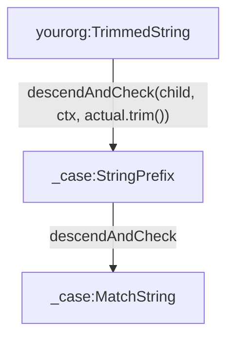

# Writing matchers

A matcher has two halves, following the
[one model](./writing-a-plugin#one-model-matchers-are-data-executors-are-behaviour)
design:

1. **The matcher descriptor** - immutable JSON data describing the
   expectation. This is what your DSL produces, and what gets written into the
   contract file.
2. **The matcher executor** - the behaviour, implemented as four side-effect
   free functions that interpret the descriptor at test time.

This page builds a small worked example: `yourorg:AnyUlid`, a matcher that
accepts any [ULID](https://github.com/ulid/spec) string.

## Designing the descriptor

First, define a constant for the type of the matcher. This is how ContractCase
finds the right executor at match time:

```ts
export const ANY_ULID_TYPE = 'yourorg:AnyUlid' as const;
```

Remember that matchers provided by ContractCase are prefixed with `_case:`, and
that this prefix is reserved - prefix your own matcher types with
[a namespace you control](./writing-a-plugin#namespacing-your-types).

Next, export an interface that describes the matcher JSON. This is exactly
what will be written to the contract file:

```ts
export interface AnyUlidMatcher {
  readonly '_case:matcher:type': typeof ANY_ULID_TYPE;
  readonly '_case:matcher:example'?: string;
}
```

The `'_case:matcher:type'` key is what makes an object a matcher: during
traversal, any object containing it is dispatched to the matching executor,
and any object without it is treated as literal data. This is also why all
ContractCase metadata is namespaced under `_case:` - it can never collide
with real user data, so users can safely match objects containing any keys of
their own.

### Parameters and special keys

Your matcher's parameters can either be namespaced (`'_case:matcher:rule'`,
`'_case:matcher:minLength'`) or plain keys (`arguments`, `functionName`) -
both styles appear in the core plugins. Prefer the namespaced style for
parameters that configure the matcher, and plain keys only where the
descriptor deliberately mirrors user-visible structure (the way the function
plugin's descriptors use `request` and `response`).

Some `_case:matcher:` keys have meanings that ContractCase itself understands,
so don't reuse them for anything else:

| Key                          | Meaning                                                                                                                                                         |
| ---------------------------- | --------------------------------------------------------------------------------------------------------------------------------------------------------------- |
| `_case:matcher:type`         | The type constant, used to find the executor                                                                                                                     |
| `_case:matcher:example`      | An example value for this matcher, eg provided by the user with `withExample`. If present, error messages prefer it, and your `strip` implementation should too   |
| `_case:matcher:resolvesTo`   | Declares the type the matcher resolves to (`'string'`, `'number'`, ...), letting parent matchers and DSL generators reason about the example without executing it |
| `_case:matcher:uniqueName`   | Names this matcher so it's saved in the contract's lookup table and can be referenced elsewhere                                                                  |
| `_case:matcher:child`        | Conventionally, the single child of a wrapping matcher                                                                                                           |

### Modifying the context

Matchers can also carry keys prefixed with `_case:context:`. These aren't
parameters - they're modifications to the [match context](#the-match-context)
that ContractCase automatically folds in before your executor runs. Because
matching is recursive, the modified context flows down to every matcher below
this one in the tree.

This is how `shapedLike` and `exactlyLike` work - they're a single "cascading
context" matcher whose only job is to set `'_case:context:matchBy'` to
`'type'` or `'exact'` for the subtree below them:

```ts
export const exactlyLike = (content: AnyCaseMatcherOrData): CoreCascadingMatcher => ({
  '_case:matcher:type': CASCADING_CONTEXT_MATCHER_TYPE,
  '_case:matcher:child': content,
  '_case:context:matchBy': 'exact',
});
```

If your matcher's behaviour should influence how everything beneath it
matches, prefer setting a context key over threading parameters by hand - it
composes with matchers from other plugins that know nothing about yours.

## The DSL function

Users don't write descriptors by hand - provide a factory that builds them:

```ts
/**
 * Matches any ULID string.
 *
 * @param example - An optional example ULID to use when writing the contract.
 */
export const anyUlid = (example?: string): AnyUlidMatcher => ({
  '_case:matcher:type': ANY_ULID_TYPE,
  ...(example != null ? { '_case:matcher:example': example } : {}),
});
```

Following the [recommended package structure](./writing-a-plugin#split-your-plugin-into-two-packages),
the constant, the interface and this factory all belong in your `-dsl`
package. To make your matcher available in other languages, see
[Declaring your DSL](./dsl-generation).

If your matcher needs additional processing - for example, combining several
matchers into a composite - do it in the DSL layer, producing a tree of plain
descriptors. The descriptors themselves must stay data-only.

## The matcher executor

The behaviour is an object with exactly four functions, typed by your constant
and descriptor:

```ts
export interface MatcherExecutor<MatcherType, T> {
  describe: NameMatcherFn<T>; // Describes the matcher in english
  check: CheckMatchFn<T>; // Checks the matcher against actual data
  strip: StripMatcherFn<T>; // Returns the example data this matcher represents
  validate: ValidateMatcherFn<T>; // Validates the matcher's own parameters
}
```

There are four functions because a matcher is used at four different moments -
not just during matching. ContractCase strips matchers to produce example
data, describes them to name interactions and build lookup keys, and validates
them before a run starts. Here's the complete executor for our ULID example:

```ts
import {
  CheckMatchFn,
  StripMatcherFn,
  ValidateMatcherFn,
  NameMatcherFn,
  MatcherExecutor,
  CaseConfigurationError,
  matchingError,
  errorWhen,
  describeMessage,
} from '@contract-case/case-plugin-base';
import { AnyData } from '@contract-case/case-plugin-dsl-types';

const ULID_REGEX = /^[0-7][0-9A-HJKMNP-TV-Z]{25}$/;
const DEFAULT_EXAMPLE = '01ARZ3NDEKTSV4RRFFQ69G5FAV';

const check: CheckMatchFn<AnyUlidMatcher> = (matcher, matchContext, actual) =>
  Promise.resolve(
    errorWhen(
      typeof actual !== 'string' || !ULID_REGEX.test(actual),
      matchingError(
        matcher,
        `'${actual}' is not a ULID string`,
        actual,
        matchContext,
      ),
    ),
  );

const strip: StripMatcherFn<AnyUlidMatcher> = (matcher): AnyData =>
  matcher['_case:matcher:example'] != null
    ? matcher['_case:matcher:example']
    : DEFAULT_EXAMPLE;

const validate: ValidateMatcherFn<AnyUlidMatcher> = (matcher, matchContext) =>
  Promise.resolve().then(() => {
    const example = matcher['_case:matcher:example'];
    if (example != null && !ULID_REGEX.test(example)) {
      throw new CaseConfigurationError(
        `The example '${example}' given to anyUlid is not itself a valid ULID`,
        matchContext,
        'BAD_INTERACTION_DEFINITION',
      );
    }
  });

const describe: NameMatcherFn<AnyUlidMatcher> = () =>
  describeMessage('any ULID string');

export const AnyUlidMatcherExecutor: MatcherExecutor<
  typeof ANY_ULID_TYPE,
  AnyUlidMatcher
> = { describe, check, strip, validate };
```

Register it on your plugin object, keyed by the type constant:

```ts
matcherExecutors: {
  [ANY_ULID_TYPE]: AnyUlidMatcherExecutor,
},
```

Some important properties of these functions, and the reasons behind them:

### All four functions must be side-effect free

ContractCase may call any of them repeatedly on the same data during a run -
for example, `strip` is called both to render examples in error messages and
during pre-verification. Don't modify the matcher descriptor, and don't keep
state between calls.

### `check` returns errors as values, it doesn't throw

`check` returns a `MatchResult`, which is an array of `CaseError` objects -
an empty array means the match passed. This is deliberate: a matcher tree
should report _every_ mismatch in a run, not abort at the first one, and
accumulating errors as values is the natural model for that.

Build results only with the helpers from `case-plugin-base`:

- `matchingError(matcher, message, actual, context)` creates an error (the
  expected value for the error message is computed for you, preferring
  `_case:matcher:example` if present)
- `errorWhen(condition, error)` returns an erroring result if the condition
  is true, and a passing one otherwise
- `makeNoErrorResult()` / `makeResults(...errors)` build results directly
- `combineResultPromises(...results)` combines the results from several
  children

The rule of thumb for what to do when something goes wrong:

- The _data didn't match_ → return error values from `check`.
- The _matcher itself is misconfigured_ → throw `CaseConfigurationError`
  (usually from `validate`).
- _Neither should be possible_ → throw `CaseCoreError` - this tells the user
  it's a bug rather than something they can fix.

### `strip` and `check` must agree

Calling `check` on the result of `strip` must always pass:

```ts
check(descriptor, context, strip(descriptor, context)); // must have no errors
```

ContractCase relies on this: before writing a contract, it verifies that every
example matches its own matchers, so a matcher whose stripped example fails
its own check will fail every contract definition it appears in. (Our
`validate` above exists for exactly this reason - it rejects a user-supplied
example that would break the invariant, with an error that explains the
problem rather than a confusing self-mismatch.)

If your matcher fundamentally can't produce example data - for example, an
auxiliary matcher designed to be combined with others via `and()` - throw a
`StripUnsupportedError` from `strip` instead.

### `describe` must uniquely describe behaviour

The string rendered from `describe` is used to name interactions and as the
key when matchers are saved in the contract's lookup table. ContractCase
relies on this property:

> Any two matchers that produce the same rendered description MUST have
> exactly the same matching behaviour in all cases.

So include every behaviour-affecting parameter in the description. Build
descriptions with the helpers `describeMessage`, `describeObject`,
`describeArray`, `concatenateDescribe` and `describeJoin` - they return a
structured `DescribeSegment` tree, which ContractCase can render flat (for
lookup keys) or pretty-print with indentation (for humans).

## Matchers with children

Matchers are recursive: a parameter of your matcher may itself be a matcher or
literal data (`AnyCaseMatcherOrData`). Your executor must not interpret
children itself, and is not allowed to call other executors directly - instead,
it descends into them through the context, which dispatches to whatever
executor the child needs:



Each of the four executor functions has a corresponding descend function on
the context: `descendAndCheck`, `descendAndStrip`, `descendAndValidate` and
`descendAndDescribe`. Here's a wrapping matcher that trims whitespace from the
actual data before handing it to its child:

```ts
import { addLocation } from '@contract-case/case-plugin-base';

const check: CheckMatchFn<TrimmedStringMatcher> = (matcher, matchContext, actual) =>
  Promise.resolve().then(() => {
    if (typeof actual !== 'string') {
      return makeResults(
        matchingError(matcher, `'${actual}' is not a string`, actual, matchContext),
      );
    }
    return matchContext.descendAndCheck(
      matcher['_case:matcher:child'],
      addLocation(':trimmedString', matchContext),
      actual.trim(),
    );
  });

const strip: StripMatcherFn<TrimmedStringMatcher> = (matcher, matchContext) =>
  matchContext.descendAndStrip(
    matcher['_case:matcher:child'],
    addLocation(':trimmedString', matchContext),
  );
```

Note the `addLocation` call on every descent. The context carries a location
trail describing where in the matcher tree execution currently is, and it's
the backbone of ContractCase's error messages - it's what lets a mismatch deep
in a nested structure say exactly where it happened. Forgetting `addLocation`
won't fail any test; it silently degrades your users' error messages, so treat
it as required.

If your matcher has several children, descend into each and combine the
results with `combineResultPromises` (for `check`) or the describe helpers
(for `describe`).

## The match context

Every executor function receives a `MatchContext`. It combines:

- **Run configuration**, under keys namespaced `_case:currentRun:context:*` -
  for example `'_case:currentRun:context:contractDir'`, or whether this run is
  defining (`'write'`) or verifying (`'read'`) a contract
  (`'_case:currentRun:context:contractMode'`). The namespacing means plugins
  can read configuration without any chance of colliding with user data.
- **Matching configuration**, under `_case:context:*` keys - most importantly
  `'_case:context:matchBy'` (`'type'` or `'exact'`), which your matcher should
  respect if it matches literal values. These are the keys that
  [context-modifying matchers](#modifying-the-context) set for their subtrees.
- **The traversal functions** described above (`descendAndCheck` and
  friends).
- **Lookup functions** for saving and retrieving named matchers and state
  variables from the contract (`saveLookupableMatcher`, `lookupMatcher`,
  `lookupVariable`). These back the `namedMatch` / `stateVariable`
  conveniences, and your matchers can use them too.
- **A logger** (`matchContext.logger`) - log through it (rather than
  `console`) so your plugin's output respects the user's
  [logLevel](../reference/configuring#loglevel-none--error--warn--debug--maintainerdebug--deepmaintainerdebug)
  and is formatted consistently with the rest of ContractCase. `debug` is for
  your users; `maintainerDebug` is for people debugging your plugin.

The context is immutable - executors never modify it, they only produce new
contexts for their children (which happens automatically via `addLocation` and
the `_case:context:` keys on descendant matchers).
