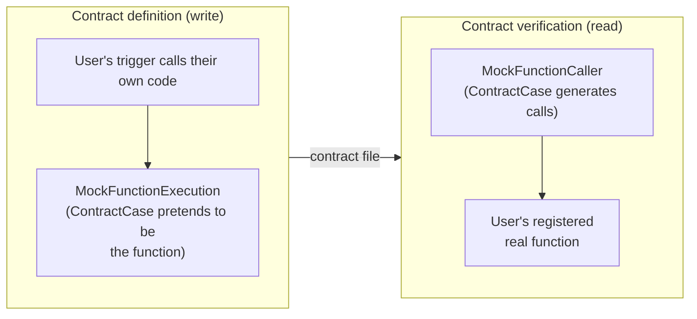
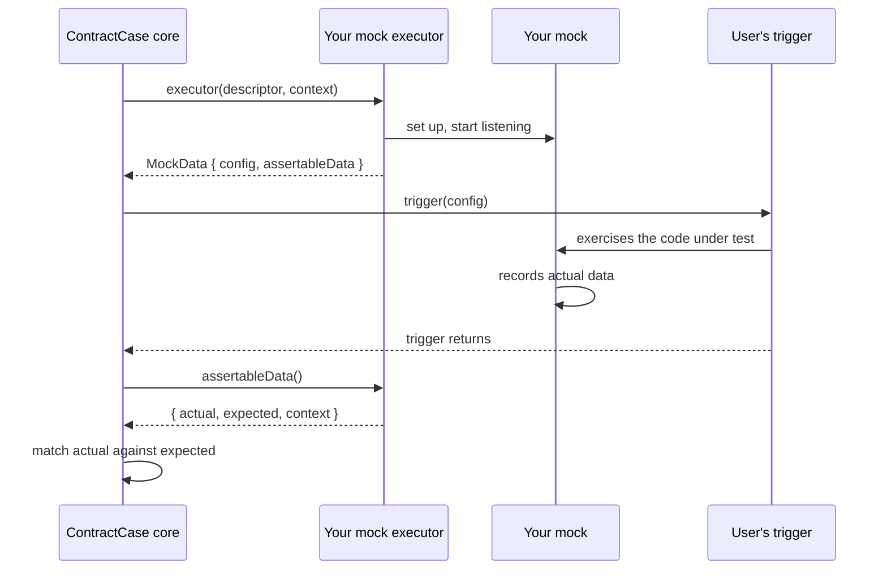

# Writing mock types

Mocks are the executable part of an interaction - during a test, the mock
pretends to be the other side of the communication boundary. Like matchers,
mocks follow the [one model](./writing-a-plugin#one-model-matchers-are-data-executors-are-behaviour)
split:

1. **The mock descriptor** - JSON data written to the contract file. It
   contains the matcher trees for the data being exchanged (for example
   `request` and `response`), plus metadata telling ContractCase how to run
   the interaction.
2. **The mock executor** - the behaviour: code that sets the mock up, listens
   for the interaction, records what actually happened, and hands the result
   back for matching.

:::tip note

You'll see the words _mock_, _interaction_ and _example_ used somewhat
interchangeably - an interaction is described by example, and executed against
a mock. In the plugin API, `Mock` generally refers to the executable side.

:::

## The mock descriptor

A mock descriptor is an object with two required metadata keys:

```ts
export type AnyMockDescriptor = {
  '_case:mock:type': string; // Which mock family this is
  '_case:run:context:setup': InternalContractCaseCoreSetup; // How to run it from each side
  request?: AnyCaseMatcher; // Conventional: the data sent to the mock
  response?: AnyCaseMatcher; // Conventional: the data returned by the mock
};
```

`request` and `response` are conventions rather than requirements - but if
your descriptor uses them, you get some helpers (like `defaultNameMock`,
below) for free.

### One interaction, two sides: the `setup` block

The defining insight of contract testing is that the same interaction is
tested from both sides: during _definition_ you test one side of the
communication against a mock of the other, and during _verification_ you test
the other side against a mock of the first. That means every interaction needs
_two_ mock behaviours - and which one runs depends on which side of the
contract you're on.

The `'_case:run:context:setup'` block writes this down:

```ts
'_case:run:context:setup': {
  write: {
    // How to run this interaction during contract definition
    type: typeof YOUR_MOCK_TYPE,
    stateVariables: 'default',
    triggers: 'provided',
  },
  read: {
    // How to run this interaction during contract verification
    type: typeof YOUR_OTHER_MOCK_TYPE,
    stateVariables: 'state',
    triggers: 'generated',
  },
},
```

For each side:

- `type` names the mock executor to run - ie, what ContractCase should
  pretend to be on that side. These are usually different: for example, an
  interaction defined by an HTTP client is run against a mock HTTP _server_
  during definition, and replayed by a mock HTTP _client_ during verification.
- `stateVariables` says where [state variables](../defining-contracts/http-client/state-definitions)
  get their values on that side: `'state'` means they come from the user's
  state handlers, `'default'` means the default values recorded in the
  contract are used.
- `triggers` says who initiates the interaction on that side: `'provided'`
  means the user supplies a [trigger function](../reference/configuring#triggers--trigger--testresponse--testerrorresponse-various-depending-on-language)
  that exercises their own code, `'generated'` means your mock generates the
  invocation itself (the way ContractCase generates its own HTTP requests when
  verifying an HTTP server).

Here's how the core function plugin uses this. It defines two mock types -
`_case:MockFunctionExecution` (ContractCase pretends to be a function
implementation) and `_case:MockFunctionCaller` (ContractCase pretends to be
the code that calls a function) - and each descriptor's `setup` block pairs
them, mirrored:



```ts
export interface MockFunctionExecutionDescriptor
  extends HasTypeForMockDescriptor<typeof MOCK_FUNCTION_EXECUTION>,
    MockFunctionDescriptor {
  '_case:run:context:setup': {
    write: {
      type: typeof MOCK_FUNCTION_EXECUTION;
      stateVariables: 'default';
      triggers: 'provided';
    };
    read: {
      type: typeof MOCK_FUNCTION_CALLER;
      stateVariables: 'state';
      triggers: 'generated';
    };
  };
}
```

Reading the `write` block: during definition, ContractCase provides a mock
function, and the user's trigger calls it. Reading the `read` block: during
verification, ContractCase generates the calls itself, against the real
function the verifying user registered - and because the verifying side is
the one with real data, that's where state handlers supply the state
variables.

Your plugin provides an executor for every mock type it names in a `setup`
block - usually a complementary pair like this one.

## The mock executor

A mock executor has two functions:

```ts
export type MockExecutor<MockType, Descriptor, AllSetupInfo> = {
  executor: MockExecutorFn<Descriptor, AllSetupInfo, MockType>;
  ensureMatchersAreNamed: (mock: Descriptor, context: MatchContext) => Descriptor;
};
```

### `ensureMatchersAreNamed`

Repeated structures in a contract (like a request/response pair that several
interactions share) are stored once, in the contract's lookup table, and
referenced by name. Before writing an interaction, ContractCase asks your
plugin to guarantee that the matcher trees in the descriptor have unique
names - this function returns a descriptor where they do.

If your descriptor uses the conventional `request` and `response` properties,
delegate to the provided `defaultNameMock` helper, which names both (deriving
a name from each matcher's description if the user didn't supply one).

### `executor`

The executor function is where the real work happens:

```ts
export type MockExecutorFn<Descriptor, AllSetupInfo, T> = (
  mock: Descriptor,
  context: MatchContext,
) => Promise<MockData<AllSetupInfo, T>>;
```

During this function you should:

1. Validate that the descriptor is correctly formed, and that any
   configuration your plugin needs is present (see
   [plugin configuration](#plugin-configuration-mockconfig) below) - throwing
   `CaseConfigurationError` with a helpful message if not.
2. Start anything that needs to listen (eg a server), or construct whatever
   the trigger will interact with (eg a mock function).
3. Return a `MockData` object.

`MockData` has two halves, corresponding to the two moments of the
interaction's lifecycle:

```ts
export type MockData<AllSetupInfo, T extends string> = {
  config: SetupInfoFor<AllSetupInfo, T>; // Given to the user's trigger, eg { baseUrl }
  assertableData: () => Promise<MockOutput>; // Called after the trigger, returns what happened
};
```

- `config` is the setup information passed to the user's trigger function -
  whatever the trigger needs to exercise the mock. For an HTTP mock this is
  the `baseUrl` of the mock server; for the function plugin it's the mock
  function itself.
- `assertableData()` is called once the trigger has run. It returns the
  `actual` data your mock observed, alongside the `expected` matcher tree and
  the context to match it in - ContractCase then runs the matching engine
  over the pair. If your mock's `triggers` mode is `'generated'`, generate and
  invoke the trigger inside `assertableData()` instead of waiting for one.

The whole lifecycle, for a `'provided'`-trigger mock:



### A worked example

Here is the core function plugin's `MockFunctionExecution` executor,
abridged. ContractCase "pretends to be a function" by constructing a real
function that records its arguments (the `actual` data) and derives its
return value from the `response` matcher tree:

```ts
const setupMockFunctionExecution = (
  { request: expectedArguments, response: expectedResponse, functionName }: MockFunctionDescriptor,
  parentContext: MatchContext,
): Promise<MockData<AllSetup, typeof MOCK_FUNCTION_EXECUTION>> =>
  Promise.resolve(
    addLocation(
      `mockFunction[${functionName}]`,
      providePluginContext(parentContext, { functionName }),
    ),
  ).then((context) => {
    let data: { actualArguments: unknown[] } | null = null;

    // The mock: a real function that records its arguments, and returns
    // whatever the response matcher tree describes
    const f = (...stringArgs: string[]): string => {
      data = { actualArguments: stringArgs.map((s) => JSON.parse(s)) };

      const functionResponse = validateFunctionResponse(
        context.descendAndStrip(expectedResponse, context),
        context,
      );
      return JSON.stringify(functionResponse);
    };

    return {
      config: {
        '_case:mock:type': MOCK_FUNCTION_EXECUTION,
        stateVariables: context['_case:currentRun:context:variables'],
        functions: { [functionName]: f },
        mock: { functionHandle: functionName },
      },
      assertableData: () =>
        Promise.resolve(data).then((result) => ({
          actual: result ? result.actualArguments : null,
          context: addLocation('arguments', context),
          expected: expectedArguments,
        })),
    };
  });

export const mockFunctionExecutionExecutor: MockExecutor<
  typeof MOCK_FUNCTION_EXECUTION,
  MockFunctionExecutionDescriptor,
  AllSetup
> = {
  executor: setupMockFunctionExecution,
  ensureMatchersAreNamed: (descriptor, parentContext) =>
    defaultNameMock(
      descriptor,
      providePluginContext(parentContext, {
        functionName: descriptor.functionName,
      }),
    ),
};
```

(See [the full source](https://github.com/case-contract-testing/contract-case/blob/main/packages/case-core-plugin-function/src/mocks/mockFunctionExecution.ts)
for the error handling this abridged version leaves out.)

A few things worth noticing:

- The executor doesn't interpret the matcher trees itself - it calls
  `context.descendAndStrip(expectedResponse, context)` to turn the response
  matcher tree into concrete data, and it hands `expectedArguments` back
  untouched from `assertableData()` for the core to match. Mocks orchestrate;
  matchers match.
- If the mock was never invoked, `actual` is `null` - the mismatch is then
  reported by the matching step, rather than the mock throwing.
- `addLocation` appears here too, for the same reason as in matchers: it's
  what makes error messages say _where_ things went wrong.

## Plugin configuration: `mockConfig`

Users configure mocks through the
[`mockConfig` configuration property](../reference/configuring#mockconfig-object),
which is keyed by your plugin's
[`shortName`](./writing-a-plugin#the-description-object):

```ts
mockConfig: {
  yourPluginShortName: {
    someSetting: 'someValue',
  },
},
```

Inside your executor, read it with the `getPluginConfig` helper:

```ts
import { getPluginConfig } from '@contract-case/case-plugin-base';

const pluginConfig = getPluginConfig(context, description);
```

`getPluginConfig` throws a `CaseConfigurationError` if there's no
configuration under your `shortName` at all - but it deliberately doesn't
validate the shape. Validate the individual settings yourself, at the time you
need them, throwing `CaseConfigurationError` with advice that tells the user
exactly which `mockConfig` key to fix. Remember that a helpful error here is
most of your plugin's user experience - it's the first thing a new user of
your plugin will see.

## Passing information from mocks to matchers

Sometimes your matchers need information that only the mock executor knows -
the way the function plugin's matchers want to know which function they're
matching arguments for. Use `providePluginContext` (as in the worked example
above) to attach a plugin-provided context object, which your matchers can
read from the context they receive.

Only use this for information about the _definition_ of the interaction. Don't
use it to smuggle the actual observed data to your matchers - actual data
flows through the `actual` parameter of `assertableData()`, where the core can
see it, report on it, and match it properly.

## Calling out to user code

If your mock needs to invoke a function provided by the user's test suite -
which may be running in another language, on the other side of the gRPC
connector - use `context.invokeFunctionByHandle(handle, args)`. Arguments and
return values cross the boundary as JSON-encoded strings. This is how the
function plugin's `MockFunctionCaller` invokes the user's registered
functions; most transport-style plugins won't need it.
