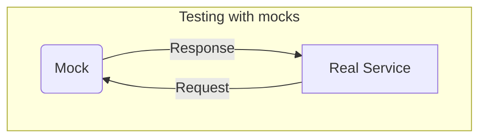
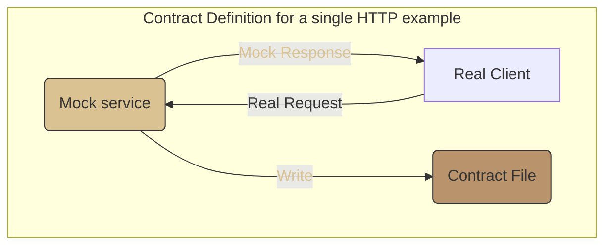
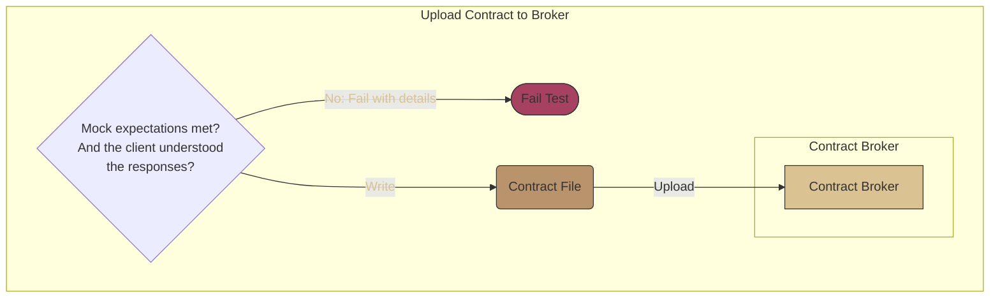
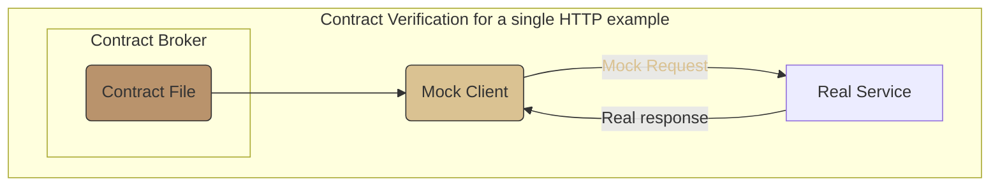

> In this documentation, `service` is used to describe any communicating client, server, message producer or consumer.

Contract testing [defined by Martin
Fowler](https://martinfowler.com/bliki/ContractTest.html) 
is a way of ensuring that two services can understand each
other, by using replayable mocks. It allows tests to run hermetically in
isolation, but retains the advantages of actually spinning the services up
together.

A contract test is divided into two halves:

First the contract is [_defined_](../defining-contracts), during which the consumer is tested against
a mock of the provider. This produces a contract file, which can be run against the real provider later.

Then this contract file is [_verified_](../verifying-contracts) against the real
provider, using a mock of the consumer that behaves the same as the consumer
tested during contract definition.

For example, for a contract written by an HTTP client consumer:

1. While defining the contract, you invoke your real client code, and your contract testing framework provides a mock server that confirms that you really do send the request you said you would.
2. While verifying the contract, the contract testing framework provides a mock
   client that behaves exactly like the client that was tested in step 1. This
   client is used to query your real server, running (usually) locally, or in a
   test environment.

The contract records the behaviour of the mock used in step 1, which is then validated against the behaviour of the real provider in step 2.

## 

In a contract test, you then write down the mock's expectations in a contract file ([contract definition](../defining-contracts), and later replay it again against the real server ([contract verification](../verifying-contracts)).

For example, in an HTTP contract test, first the mock is configured with an
expected request and response pair. Then, if the real request matched the
expectations, the contract file is written.

Contract definition is where you write one or more expectations for the mock. In `ContractCase`, these expectations are called Examples.

- Each example is independent

Then, if the mock has received all the expected requests, and your tests to ensure
the responses can be understood also pass, then the contract file will be
written.

This contract file can then be uploaded to a broker, so that it can be
downloaded by other dependencies that need it. The broker is a key part of the value of contract testing - it might notify the
relevant service CI pipelines that there is a new contract, and it can also remember verification results. You can read more about brokers in [configuring a broker](./defining-contracts/brokers).

The next step is to run one or more contract file(s) against the real service
real service. This confirms that the expectation of the client(s) are met by the real service.

Next, read about [defining a contract in ContractCase](./defining-contracts).

<!--- cspell:dictionaries !html --->
